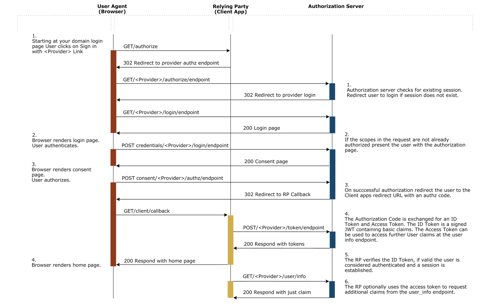

# OIDC

## openid connect

OpenID Connect is a simple identity layer built on top of the OAuth 2.0 protocol, which allows clients to verify the identity of an end user based on the authentication performed by an authorization server or identity provider (IdP).

OIDC supprots the following authentication flows:
- The **Implicit Flow** is required for apps that have no “back end” logic on the web server, like a Javascript app.
- The **Authentication (or Basic) Flow** is designed for apps that have a back end that can communicate with the IdP away from prying eyes.
- The **Resource Owner Password Grant** does not have an login UI and is useful when access to a web browser is not possible.
- The **Client Credentials Grant** is useful for machine to machine authorization.

### Authentication Flow
[reference](https://docs.axway.com/bundle/APIGateway_762_OAuthUserGuide_allOS_en_HTML5/page/Content/OAuthGuideTopics/OpenidImport/openid_flow.htm)



When client app redirects the user to the authorization endpointm it should have the following parameters:

| parameters | description |
| --- | --- |
| response_type | must be set to `code` |
| client_id | the client id we registered in the IdP |
| redirect_uri | the location where the authorization code will be sent |
| scope | Optional a space delimited list of scopes, which indicate the access to the resource owner's data requested by the application (openid is the required scope) |
| state | Recommended. Any state the consumer wants reflected back to itself after approval during the callback. This value is used to prevent cross-site request forgery (CSRF) attacks, the consumer delivers this value to the authorization server when making an authorization request. For this reason, the value must be opaque, kept secret by the consumer, and known only to the consumer and the OAuth provider |

for example:
```
http://127.0.0.1:5556/dex/auth?client_id=example-app&redirect_uri=http%3A%2F%2F127.0.0.1%3A5555%2Fcallback&response_type=code&scope=openid+profile+email&state=I+wish+to+wash+my+irish+wristwatch
```

for details of state, plz refer to: https://tools.ietf.org/html/rfc6819#section-3.6 and [CSRF.md](./CSRF.md)

After IdP verifies the user's identity, it redirects the user back to the client app with a code that can be exchanged for an ID token.

for example:
```
http://127.0.0.1:5555/callback?code=ewwj54h3zgiwaikpyolcv7nwc&state=I+wish+to+wash+my+irish+wristwatch
```

**no one could understand the code except the IdP**

Then, client app:
1. extract the state and verify the state
2. extract the code
3. use the code to exchange the token which contains access_token, refresh_token and id_token.
4. extract and verify the id token from the token
5. return id token to the user

Access token could be used to call `/userinfo` endpoint to fetch users' info, refresh_token could be used to refresh the token.

Step 3 and step 4 are parts of oauth2 and oidc package, we could use existing ones for each program language. if you want to implement them by yourself, plz refer to the oauth2 framework [RFC 6749](https://www.rfc-editor.org/rfc/rfc6749.html).

User once gets an id token, he/she could use it to call the api belonged to client-app, client-app would consume [claims](https://auth0.com/docs/scopes/openid-connect-scopes) (which are name/value pairs that contain information about a user) to verify the identify of the user.

for example:
```json
{
  "iss": "http://127.0.0.1:5556/dex",
  "sub": "CiQxZDkyYzA3Ni1jYjQ4LTQ4ZjEtYTk5Ni03YzhkMGJkZmE4NjMSBWxvY2Fs",
  "aud": "example-app",
  "exp": 1615453229,
  "iat": 1615366829,
  "at_hash": "hWaeSk3_aWCdJ8XJ_wAlPg",
  "c_hash": "LjuZ4Tw49jVcr1dGqQ5vqw",
  "email": "tianqiuhuang@gmail.com",
  "email_verified": true,
  "name": "TQ"
}
```

### Authorization Code Flow with Proof Key for Code Exchange (PKCE)

When public clients (e.g., native and single-page applications) request Access Tokens, some additional security concerns are posed that are not mitigated by the Authorization Code Flow alone. This is because:

**native app:**
- Cannot securely store a Client Secret. Decompiling the app will reveal the Client Secret, which is bound to the app and is the same for all users and devices.
- May make use of a custom URL scheme to capture redirects (e.g., MyApp://) potentially allowing malicious applications to receive an Authorization Code from your Authorization Server.

**Single-page apps:**
- Cannot securely store a Client Secret because their entire source is available to the browser.

Given these situations, OAuth 2.0 provides a version of the Authorization Code Flow which makes use of a Proof Key for Code Exchange (PKCE) (defined in OAuth 2.0 RFC 7636).

The PKCE-enhanced Authorization Code Flow introduces a secret created by the calling application that can be verified by the authorization server; this secret is called the Code Verifier. Additionally, the calling app creates a transform value of the Code Verifier called the Code Challenge and sends this value over HTTPS to retrieve an Authorization Code. This way, a malicious attacker can only intercept the Authorization Code, and they cannot exchange it for a token without the Code Verifier.

for more details, plz refer to: https://auth0.com/docs/flows/authorization-code-flow-with-proof-key-for-code-exchange-pkce

### Implicit Flow

Not only `Authorization Code Flow with Proof Key for Code Exchange (PKCE)`, but also `implicit flow` could be used for the SPA, but we'd better only use the latter one when the SPA doesn't need an Access Token.

We should use this flow for login-only use cases.


### Client Credential Grant

With machine-to-machine (M2M) applications, such as CLIs, daemons, or services running on your back-end, the system authenticates and authorizes the app rather than a user. For this scenario, typical authentication schemes like username + password or social logins don't make sense. Instead, M2M apps use the Client Credentials Flow (defined in [OAuth 2.0 RFC 6749, section 4.4](https://tools.ietf.org/html/rfc6749#section-4.4)), in which they pass along their Client ID and Client Secret to authenticate themselves and get a token.

### Resource Owner Password Grant
we might use this flow when we trust the client app very much, we just send credentials like username/password to client-app. Because credentials are sent to the backend and can be stored for future use before being exchanged for an Access Token, it is imperative that the application is absolutely trusted with this information.

## WorkShop

setup your own IdP and write a client-app to implement the `Authentication Flow`.

Refer to [setup](./setup-idp-and-client-app.md).
